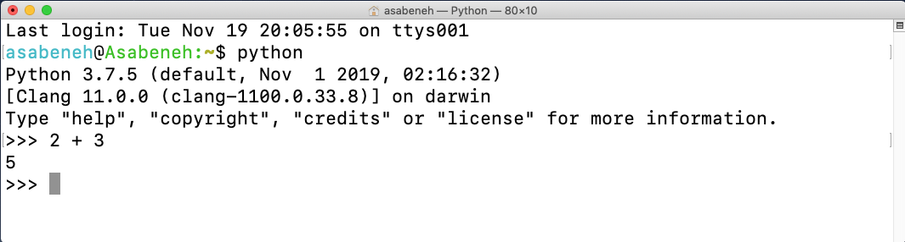
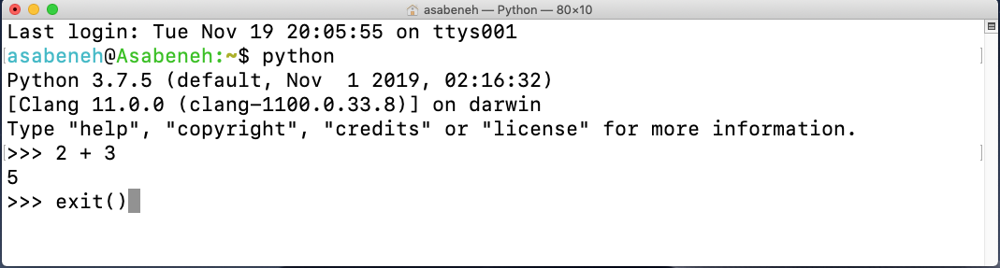
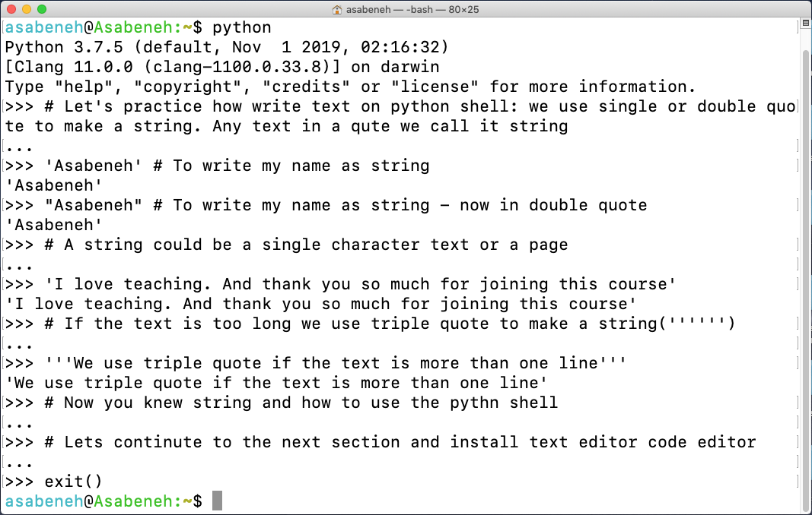
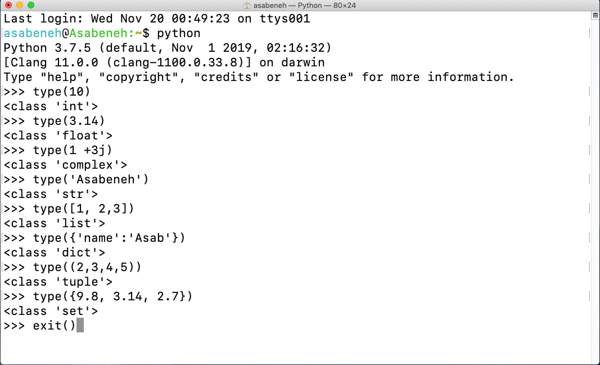

# 🐍 30 Ngày Học Python

| # Ngày | Chủ Đề |
|--------|:-------:|
| 01 | [Giới Thiệu](./README.md) |
| 02 | [Biến, Hàm Có Sẵn](./02_Day_Variables_builtin_functions/02_variables_builtin_functions.md) |
| 03 | [Toán Tử](./03_Day_Operators/03_operators.md) |
| 04 | [Chuỗi](./04_Day_Strings/04_strings.md) |
| 05 | [Danh Sách](./05_Day_Lists/05_lists.md) |
| 06 | [Tuple](./06_Day_Tuples/06_tuples.md) |
| 07 | [Tập Hợp](./07_Day_Sets/07_sets.md) |
| 08 | [Từ Điển](./08_Day_Dictionaries/08_dictionaries.md) |
| 09 | [Điều Kiện](./09_Day_Conditionals/09_conditionals.md) |
| 10 | [Vòng Lặp](./10_Day_Loops/10_loops.md) |
| 11 | [Hàm](./11_Day_Functions/11_functions.md) |
| 12 | [Module](./12_Day_Modules/12_modules.md) |
| 13 | [List Comprehension](./13_Day_List_comprehension/13_list_comprehension.md) |
| 14 | [Hàm Bậc Cao](./14_Day_Higher_order_functions/14_higher_order_functions.md) |
| 15 | [Lỗi Kiểu Dữ Liệu Python](./15_Day_Python_type_errors/15_python_type_errors.md) |
| 16 | [Ngày Giờ Python](./16_Day_Python_date_time/16_python_datetime.md) |
| 17 | [Xử Lý Ngoại Lệ](./17_Day_Exception_handling/17_exception_handling.md) |
| 18 | [Biểu Thức Chính Quy](./18_Day_Regular_expressions/18_regular_expressions.md) |
| 19 | [Xử Lý File](./19_Day_File_handling/19_file_handling.md) |
| 20 | [Quản Lý Gói Python](./20_Day_Python_package_manager/20_python_package_manager.md) |
| 21 | [Lớp và Đối Tượng](./21_Day_Classes_and_objects/21_classes_and_objects.md) |


<small>🧡🧡🧡 CHÚC MỪNG LẬP TRÌNH 🧡🧡🧡</small>

---

<div align="center">
  <h1>30 Ngày Học Python: Ngày 1 - Giới Thiệu</h1>
</div>

[Ngày 2 >>](./02_Day_Variables_builtin_functions/02_variables_builtin_functions.md)

---

- [🐍 30 Ngày Học Python](#-30-ngày-học-python)
- [📘 Ngày 1](#-ngày-1)
  - [Chào Mừng](#chào-mừng)
  - [Giới Thiệu](#giới-thiệu)
  - [Tại Sao Chọn Python?](#tại-sao-chọn-python)
  - [Cài Đặt Môi Trường](#cài-đặt-môi-trường)
    - [Cài Đặt Python](#cài-đặt-python)
    - [Python Shell](#python-shell)
    - [Cài Đặt Visual Studio Code](#cài-đặt-visual-studio-code)
      - [Cách Sử Dụng Visual Studio Code](#cách-sử-dụng-visual-studio-code)
  - [Python Cơ Bản](#python-cơ-bản)
    - [Cú Pháp Python](#cú-pháp-python)
    - [Thụt Lề Python](#thụt-lề-python)
    - [Chú Thích](#chú-thích)
    - [Kiểu Dữ Liệu](#kiểu-dữ-liệu)
      - [Số](#số)
      - [Chuỗi](#chuỗi)
      - [Boolean](#boolean)
      - [Danh Sách](#danh-sách)
      - [Từ Điển](#từ-điển)
      - [Tuple](#tuple)
      - [Tập Hợp](#tập-hợp)
    - [Kiểm Tra Kiểu Dữ Liệu](#kiểm-tra-kiểu-dữ-liệu)
    - [File Python](#file-python)
  - [💻 Bài Tập - Ngày 1](#-bài-tập---ngày-1)
    - [Bài Tập: Mức 1](#bài-tập-mức-1)
    - [Bài Tập: Mức 2](#bài-tập-mức-2)
    - [Bài Tập: Mức 3](#bài-tập-mức-3)

# 📘 Ngày 1

## Chào Mừng

**Chúc mừng** bạn đã quyết định tham gia thử thách lập trình _30 ngày học Python_. Trong thử thách này, bạn sẽ học tất cả những gì cần thiết để trở thành lập trình viên Python, cùng với toàn bộ khái niệm về lập trình. Khi hoàn thành thử thách, bạn sẽ nhận được chứng chỉ thử thách lập trình _30NgàyHọcPython_.


## Giới Thiệu

Python là ngôn ngữ lập trình bậc cao dành cho mục đích chung. Đây là ngôn ngữ lập trình mã nguồn mở, thông dịch (interpreted) và hướng đối tượng (object-oriented). Python được tạo ra bởi lập trình viên người Hà Lan Guido van Rossum. Tên của ngôn ngữ lập trình Python được lấy cảm hứng từ chương trình hài kịch của Anh *Monty Python's Flying Circus*. Phiên bản đầu tiên được phát hành vào ngày 20 tháng 2 năm 1991. Thử thách 30 ngày học Python này sẽ giúp bạn học phiên bản mới nhất của Python, Python 3, từng bước một. Các chủ đề được chia thành 30 ngày, mỗi ngày chứa nhiều chủ đề với các giải thích dễ hiểu, ví dụ thực tế và nhiều bài tập thực hành cùng dự án.

Thử thách này được thiết kế cho cả người mới bắt đầu lẫn những người có kinh nghiệm muốn học ngôn ngữ lập trình Python. Có thể mất từ 30 đến 100 ngày để hoàn thành thử thách. Những người tham gia tích cực trong nhóm Telegram có xác suất hoàn thành thử thách cao hơn.

Thử thách này dễ đọc, được viết theo phong cách hội thoại thân thiện, hấp dẫn và truyền cảm hứng, nhưng đồng thời cũng rất đòi hỏi. Bạn cần dành nhiều thời gian để hoàn thành thử thách này. 

## Tại Sao Chọn Python?

Đây là ngôn ngữ lập trình rất gần với ngôn ngữ con người và vì vậy nó dễ học và dễ sử dụng. Python được sử dụng bởi nhiều ngành công nghiệp và công ty (bao gồm cả Google). Nó đã được dùng để phát triển ứng dụng web, ứng dụng desktop, quản trị hệ thống và các thư viện học máy. Python là ngôn ngữ được ưa chuộng nhiều trong cộng đồng khoa học dữ liệu và học máy. Tôi hy vọng điều này đủ để thuyết phục bạn bắt đầu học Python. Python đang chiếm lĩnh thế giới và bạn nên nắm bắt nó trước khi bị bỏ lại phía sau.

## Cài Đặt Môi Trường

### Cài Đặt Python

Để chạy một script Python, bạn cần cài đặt Python. Hãy [tải xuống](https://www.python.org/) Python.
Nếu bạn dùng Windows, nhấn vào nút được khoanh tròn màu đỏ.

[](https://www.python.org/)

Nếu bạn dùng macOS, nhấn vào nút được khoanh tròn màu đỏ.

[](https://www.python.org/)

Để kiểm tra xem Python đã được cài đặt chưa, hãy gõ lệnh sau vào terminal của thiết bị:

```shell
python3 --version
```


Như bạn có thể thấy từ terminal, tôi đang dùng phiên bản _Python 3.7.5_. Phiên bản Python của bạn có thể khác với của tôi nhưng phải là 3.6 trở lên. Nếu bạn thấy được phiên bản Python, chúc mừng — Python đã được cài đặt trên máy của bạn. Hãy tiếp tục sang phần tiếp theo.

### Python Shell

Python là ngôn ngữ kịch bản thông dịch nên không cần biên dịch. Điều đó có nghĩa là nó thực thi mã từng dòng một. Python đi kèm với _Python Shell (Python Interactive Shell — Môi Trường Tương Tác Python)_. Nó được dùng để thực thi một lệnh Python đơn lẻ và nhận kết quả.

Python Shell chờ đợi mã Python từ người dùng. Khi bạn nhập mã, nó sẽ thông dịch và hiển thị kết quả ở dòng tiếp theo. Mở terminal hoặc command prompt (cmd) và gõ:

```shell
python
```


Python interactive shell đã mở và đang chờ bạn viết mã Python (Python script). Bạn sẽ viết script Python của mình bên cạnh ký hiệu >>> rồi nhấn Enter. Hãy viết script đầu tiên trên Python scripting shell.



Tuyệt vời, bạn đã viết script Python đầu tiên trên Python interactive shell. Làm thế nào để đóng Python interactive shell? Để đóng shell, bên cạnh ký hiệu >>> hãy gõ lệnh **exit()** và nhấn Enter.



Bây giờ bạn đã biết cách mở Python interactive shell và cách thoát khỏi nó.

Python sẽ trả về kết quả nếu bạn viết script mà Python hiểu được; nếu không, nó sẽ trả về lỗi. Hãy cố tình tạo một lỗi để xem Python sẽ trả về gì.


Như bạn có thể thấy từ lỗi được trả về, Python rất thông minh — nó biết lỗi chúng ta mắc phải là _Syntax Error: invalid syntax_. Dùng x để nhân trong Python là lỗi cú pháp vì (x) không phải là cú pháp hợp lệ trong Python. Thay vì (**x**) chúng ta dùng dấu hoa thị (*) để nhân. Lỗi được trả về chỉ rõ cần sửa gì.

Quá trình xác định và loại bỏ lỗi khỏi chương trình gọi là _debugging (gỡ lỗi)_. Hãy gỡ lỗi bằng cách thay x bằng *.


Lỗi của chúng ta đã được sửa, mã chạy được và cho ra kết quả mong đợi. Là lập trình viên, bạn sẽ gặp những lỗi như thế này hàng ngày. Biết cách gỡ lỗi là rất quan trọng. Để giỏi gỡ lỗi, bạn nên hiểu mình đang gặp phải loại lỗi nào. Một số lỗi Python bạn có thể gặp là _SyntaxError_, _IndexError_, _NameError_, _ModuleNotFoundError_, _KeyError_, _ImportError_, _AttributeError_, _TypeError_, _ValueError_, _ZeroDivisionError_, v.v. Chúng ta sẽ tìm hiểu thêm về các **_loại lỗi_** Python khác nhau trong các phần sau.

Hãy thực hành thêm cách dùng Python interactive shell. Mở terminal hoặc command prompt và gõ **python**.


Python interactive shell đã mở. Hãy thực hiện một số phép toán cơ bản (cộng, trừ, nhân, chia, chia lấy dư, lũy thừa).

Hãy làm toán trước khi viết bất kỳ mã Python nào:

- 2 + 3 = 5
- 3 - 2 = 1
- 3 \* 2 = 6
- 3 / 2 = 1.5
- 3 \*\* 2 = 3 x 3 = 9

Trong Python, chúng ta còn có các phép toán bổ sung sau:

- 3 % 2 = 1 => tìm số dư
- 3 // 2 = 1 => bỏ phần dư (chia lấy phần nguyên)

Hãy chuyển các biểu thức toán học trên sang mã Python. Python shell đã được mở, hãy viết một chú thích ở đầu shell.

_Chú thích_ là phần mã không được Python thực thi. Vì vậy chúng ta có thể để lại một số văn bản trong mã để làm cho mã dễ đọc hơn. Python không chạy phần chú thích. Chú thích trong Python bắt đầu bằng ký hiệu thăng (#). Đây là cách bạn viết chú thích trong Python:

```shell
 # chú thích bắt đầu bằng dấu thăng
 # đây là chú thích Python, vì nó bắt đầu bằng ký hiệu (#)
```


Trước khi chuyển sang phần tiếp theo, hãy thực hành thêm trên Python interactive shell. Đóng shell đang mở bằng cách gõ _exit()_ trên shell rồi mở lại và thực hành cách viết văn bản trên Python shell.



### Cài Đặt Visual Studio Code

Python interactive shell rất tốt để thử và kiểm tra các đoạn script nhỏ nhưng không phù hợp cho dự án lớn. Trong môi trường làm việc thực tế, các lập trình viên dùng nhiều trình soạn thảo mã khác nhau để viết code. Trong thử thách lập trình Python 30 ngày này, chúng ta sẽ dùng Visual Studio Code. Visual Studio Code là trình soạn thảo mã nguồn mở rất phổ biến. Tôi là fan của vscode và tôi khuyên bạn nên [tải xuống](https://code.visualstudio.com/) visual studio code; nhưng nếu bạn thích trình soạn thảo khác, hãy cứ dùng cái bạn có.

[](https://code.visualstudio.com/)

Nếu bạn đã cài đặt visual studio code, hãy xem cách sử dụng nó. Nếu bạn thích video, bạn có thể xem [Video hướng dẫn](https://www.youtube.com/watch?v=bn7Cx4z-vSo) Visual Studio Code cho Python này.

#### Cách Sử Dụng Visual Studio Code

Mở visual studio code bằng cách nhấp đúp vào biểu tượng visual studio. Khi mở lên bạn sẽ thấy giao diện như thế này. Hãy thử tương tác với các biểu tượng được ghi chú.


Tạo một thư mục tên 30DaysOfPython trên desktop của bạn. Sau đó mở nó bằng visual studio code.


Sau khi mở, bạn sẽ thấy các phím tắt để tạo file và thư mục trong thư mục dự án 30DaysOfPython. Như bạn có thể thấy bên dưới, tôi đã tạo file đầu tiên, `helloworld.py`. Bạn có thể làm tương tự.


Sau một ngày dài code, bạn muốn đóng trình soạn thảo, đúng không? Đây là cách bạn đóng dự án đang mở.


Chúc mừng, bạn đã hoàn thành việc cài đặt môi trường phát triển. Hãy bắt đầu code thôi.

## Python Cơ Bản

### Cú Pháp Python

Một script Python có thể được viết trong Python interactive shell hoặc trong trình soạn thảo mã. File Python có đuôi mở rộng .py.

### Thụt Lề Python

Thụt lề là khoảng trắng trong văn bản. Thụt lề trong nhiều ngôn ngữ được dùng để tăng khả năng đọc mã; tuy nhiên, Python dùng thụt lề để tạo các khối mã. Trong các ngôn ngữ lập trình khác, dấu ngoặc nhọn được dùng để tạo khối mã thay vì thụt lề. Một trong những lỗi phổ biến khi viết mã Python là thụt lề không đúng.


### Chú Thích

Chú thích đóng vai trò quan trọng trong việc tăng khả năng đọc mã và cho phép các lập trình viên để lại ghi chú trong code. Trong Python, bất kỳ văn bản nào đứng trước ký hiệu thăng (#) đều được coi là chú thích và sẽ không được thực thi khi chạy code.

**Ví dụ: Chú Thích Một Dòng**

```shell
    # Đây là chú thích đầu tiên
    # Đây là chú thích thứ hai
    # Python đang chiếm lĩnh thế giới
```

**Ví dụ: Chú Thích Nhiều Dòng**

Dấu ba nháy có thể được dùng cho chú thích nhiều dòng nếu nó không được gán cho biến:

```shell
"""Đây là chú thích nhiều dòng
chú thích nhiều dòng chiếm nhiều dòng.
python đang chiếm lĩnh thế giới
"""
```

### Kiểu Dữ Liệu

Trong Python có nhiều loại kiểu dữ liệu. Hãy bắt đầu với những kiểu phổ biến nhất. Các kiểu dữ liệu khác nhau sẽ được đề cập chi tiết trong các phần khác. Hiện tại, hãy cùng điểm qua các kiểu dữ liệu khác nhau và làm quen với chúng. Bạn không cần phải hiểu rõ hoàn toàn ngay bây giờ.

#### Số

- Integer (Số nguyên): Số nguyên (âm, không và dương)
    Ví dụ:
    ... -3, -2, -1, 0, 1, 2, 3 ...
- Float (Số thực): Số thập phân
    Ví dụ:
    ... -3.5, -2.25, -1.0, 0.0, 1.1, 2.2, 3.5 ...
- Complex (Số phức):
    Ví dụ:
    1 + j, 2 + 4j

#### Chuỗi

Tập hợp một hoặc nhiều ký tự đặt trong dấu nháy đơn hoặc nháy kép. Nếu chuỗi có nhiều hơn một câu thì dùng ba dấu nháy.

**Ví dụ:**

```py
'Asabeneh'
'Phần Lan'
'Python'
'Tôi yêu dạy học'
'Tôi hy vọng bạn đang tận hưởng ngày đầu tiên của Thử Thách 30NgàyHọcPython'
```

#### Boolean

Kiểu dữ liệu boolean có giá trị True (Đúng) hoặc False (Sai). T và F phải luôn viết hoa.

**Ví dụ:**

```python
    True  #  Đèn có đang bật không? Nếu đang bật thì giá trị là True
    False # Đèn có đang bật không? Nếu đang tắt thì giá trị là False
```

#### Danh Sách

Danh sách Python là tập hợp có thứ tự cho phép lưu các phần tử thuộc nhiều kiểu dữ liệu khác nhau. Danh sách tương tự như mảng (array) trong JavaScript.

**Ví dụ:**

```py
[0, 1, 2, 3, 4, 5]  # tất cả cùng kiểu dữ liệu - danh sách số
['Chuối', 'Cam', 'Xoài', 'Bơ'] # tất cả cùng kiểu dữ liệu - danh sách chuỗi (trái cây)
['Phần Lan','Estonia', 'Thụy Điển','Na Uy'] # tất cả cùng kiểu dữ liệu - danh sách chuỗi (quốc gia)
['Chuối', 10, False, 9.81] # các kiểu dữ liệu khác nhau trong danh sách - chuỗi, số nguyên, boolean và số thực
```

#### Từ Điển

Đối tượng từ điển Python là tập hợp dữ liệu không có thứ tự theo định dạng cặp khóa-giá trị (key-value).

**Ví dụ:**

```py
{
'ten': 'Asabeneh',
'ho': 'Yetayeh',
'quoc_gia': 'Phần Lan',
'tuoi': 250,
'da_lap_gia_dinh': True,
'ky_nang': ['JS', 'React', 'Node', 'Python']
}
```

#### Tuple

Tuple là tập hợp có thứ tự của các kiểu dữ liệu khác nhau giống như danh sách nhưng tuple không thể thay đổi sau khi được tạo. Chúng là bất biến (immutable).

**Ví dụ:**

```py
('Asabeneh', 'Pawel', 'Brook', 'Abraham', 'Lidiya') # Tên người
```

```py
('Trái Đất', 'Sao Mộc', 'Hải Vương', 'Sao Hỏa', 'Sao Kim', 'Thổ Tinh', 'Thiên Vương', 'Sao Thủy') # các hành tinh
```

#### Tập Hợp

Tập hợp là kiểu dữ liệu tương tự danh sách và tuple. Không giống danh sách và tuple, tập hợp không phải là tập hợp có thứ tự. Giống như trong Toán học, tập hợp trong Python chỉ lưu các phần tử duy nhất (không trùng lặp).

Trong các phần sau, chúng ta sẽ đi vào chi tiết từng kiểu dữ liệu Python.

**Ví dụ:**

```py
{2, 4, 3, 5}
{3.14, 9.81, 2.7} # thứ tự không quan trọng trong tập hợp
```

### Kiểm Tra Kiểu Dữ Liệu

Để kiểm tra kiểu dữ liệu của một dữ liệu/biến nhất định, chúng ta dùng hàm **type**. Trong terminal sau đây bạn sẽ thấy các kiểu dữ liệu Python khác nhau:



### File Python

Trước tiên hãy mở thư mục dự án của bạn, 30DaysOfPython. Nếu bạn chưa có thư mục này, hãy tạo một thư mục tên 30DaysOfPython. Trong thư mục này, tạo một file tên helloworld.py. Bây giờ hãy làm những gì chúng ta đã làm trên Python interactive shell bằng visual studio code.

Python interactive shell in kết quả mà không cần dùng **print** nhưng trong visual studio code để thấy kết quả, chúng ta cần dùng hàm có sẵn _print()_. Hàm có sẵn _print()_ nhận một hoặc nhiều đối số như sau: _print('đối_số_1', 'đối_số_2', 'đối_số_3')_. Xem các ví dụ bên dưới.

**Ví dụ:**

Tên file là `helloworld.py`

```py
# Ngày 1 - Thử Thách 30NgàyHọcPython

print(2 + 3)             # cộng(+)
print(3 - 1)             # trừ(-)
print(2 * 3)             # nhân(*)
print(3 / 2)             # chia(/)
print(3 ** 2)            # lũy thừa(**)
print(3 % 2)             # chia lấy dư(%)
print(3 // 2)            # chia lấy phần nguyên(//)

# Kiểm tra kiểu dữ liệu
print(type(10))          # Int
print(type(3.14))        # Float
print(type(1 + 3j))      # Số phức
print(type('Asabeneh'))  # String
print(type([1, 2, 3]))   # List
print(type({'name':'Asabeneh'})) # Dictionary
print(type({9.8, 3.14, 2.7}))    # Set
print(type((9.8, 3.14, 2.7)))    # Tuple
```

Để chạy file Python, hãy xem hình ảnh bên dưới. Bạn có thể chạy file Python bằng cách nhấn nút màu xanh trên Visual Studio Code hoặc gõ _python helloworld.py_ trong terminal.


🌕 Bạn thật tuyệt vời. Bạn vừa hoàn thành thử thách ngày 1 và đang trên con đường đến sự vĩ đại. Bây giờ hãy làm một số bài tập cho não và cơ bắp của bạn.

## 💻 Bài Tập - Ngày 1

### Bài Tập: Mức 1

1. Kiểm tra phiên bản Python bạn đang dùng
2. Mở Python interactive shell và thực hiện các phép tính sau. Các toán hạng là 3 và 4.
   - cộng(+)
   - trừ(-)
   - nhân(\*)
   - chia lấy dư(%)
   - chia(/)
   - lũy thừa(\*\*)
   - chia lấy phần nguyên(//)
3. Viết các chuỗi sau trên Python interactive shell:
   - Tên của bạn
   - Họ của bạn
   - Quốc gia của bạn
   - Tôi đang tận hưởng 30 ngày học Python
4. Kiểm tra kiểu dữ liệu của các dữ liệu sau:
   - 10
   - 9.8
   - 3.14
   - 4 - 4j
   - ['Asabeneh', 'Python', 'Phần Lan']
   - Tên của bạn
   - Họ của bạn
   - Quốc gia của bạn

### Bài Tập: Mức 2

1. Tạo một thư mục tên day_1 trong thư mục 30DaysOfPython. Trong thư mục day_1, tạo file Python helloworld.py và lặp lại các câu hỏi 1, 2, 3 và 4. Nhớ dùng _print()_ khi làm việc trên file Python. Điều hướng đến thư mục nơi bạn đã lưu file và chạy nó.

### Bài Tập: Mức 3

1. Viết ví dụ cho các kiểu dữ liệu Python khác nhau như Number (Integer, Float, Complex), String, Boolean, List, Tuple, Set và Dictionary.
2. Tìm [khoảng cách Euclidean](https://vi.wikipedia.org/wiki/Kho%E1%BA%A3ng_c%C3%A1ch_Euclid) giữa (2, 3) và (10, 8)

🎉 CHÚC MỪNG! 🎉

[Ngày 2 >>](./02_Day_Variables_builtin_functions/02_variables_builtin_functions.md)
