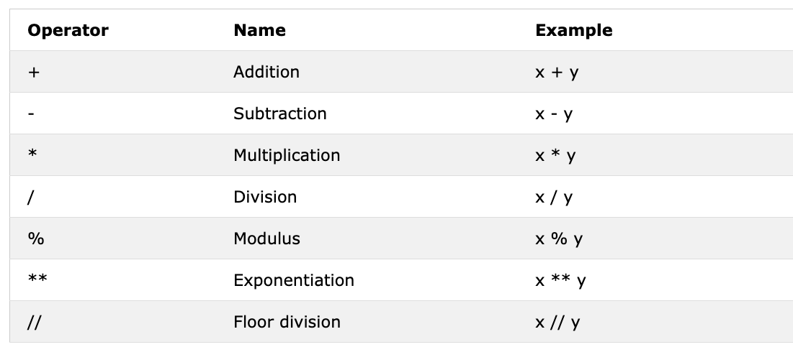
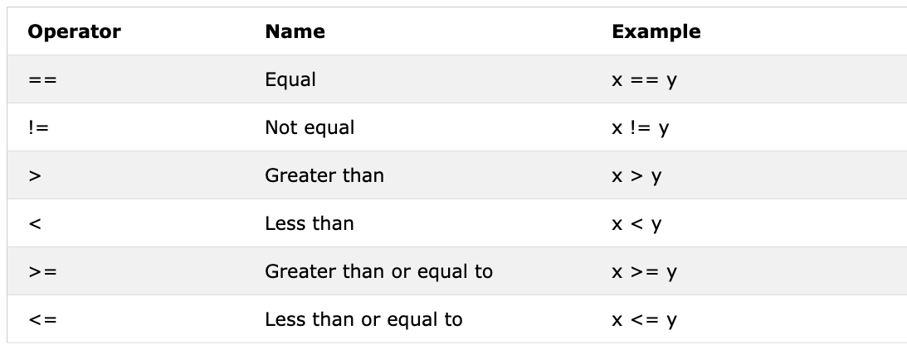

<div align="center">
  <h1>30 Ngày Học Python: Ngày 3 - Toán Tử</h1>
</div>

[<< Ngày 2](../02_Day_Variables_builtin_functions/02_variables_builtin_functions.md) | [Ngày 4 >>](../04_Day_Strings/04_strings.md)


- [📘 Ngày 3](#-ngày-3)
  - [Boolean](#boolean)
  - [Toán Tử](#toán-tử)
    - [Toán Tử Gán](#toán-tử-gán)
    - [Toán Tử Số Học](#toán-tử-số-học)
    - [Toán Tử So Sánh](#toán-tử-so-sánh)
    - [Toán Tử Logic](#toán-tử-logic)
  - [💻 Bài Tập - Ngày 3](#-bài-tập---ngày-3)

# 📘 Ngày 3

## Boolean

Kiểu dữ liệu boolean đại diện cho một trong hai giá trị: _True_ (Đúng) hoặc _False_ (Sai). Việc sử dụng các kiểu dữ liệu này sẽ trở nên rõ ràng khi chúng ta bắt đầu dùng toán tử so sánh. Chữ cái đầu **T** của True và **F** của False phải viết hoa, khác với JavaScript.

**Ví dụ: Giá Trị Boolean**

```py
print(True)
print(False)
```

## Toán Tử

Ngôn ngữ Python hỗ trợ nhiều loại toán tử khác nhau. Trong phần này, chúng ta sẽ tập trung vào một số loại chính.

### Toán Tử Gán

Toán tử gán dùng để gán giá trị cho biến. Hãy lấy dấu = làm ví dụ. Dấu bằng trong Toán học cho thấy hai giá trị bằng nhau, nhưng trong Python nó có nghĩa là chúng ta đang lưu một giá trị vào một biến nhất định và gọi đó là phép gán. Bảng dưới đây hiển thị các loại toán tử gán Python khác nhau.


### Toán Tử Số Học

- Cộng (+): a + b
- Trừ (-): a - b
- Nhân (*): a * b
- Chia (/): a / b
- Chia lấy dư (%): a % b
- Chia lấy phần nguyên (//): a // b
- Lũy thừa (**): a ** b



**Ví dụ: Số Nguyên**

```py
# Phép toán số học trong Python
# Số nguyên
print('Cộng: ', 1 + 2)        # 3
print('Trừ: ', 2 - 1)         # 1
print('Nhân: ', 2 * 3)        # 6
print('Chia: ', 4 / 2)        # 2.0  - Chia trong Python cho kết quả số thực
print('Chia: ', 6 / 2)        # 3.0
print('Chia: ', 7 / 2)        # 3.5
print('Chia lấy phần nguyên: ', 7 // 2)   # 3 - không có phần thập phân
print('Chia lấy phần nguyên: ', 7 // 3)   # 2
print('Chia lấy dư: ', 3 % 2)             # 1 - số dư
print('Lũy thừa: ', 2 ** 3)               # 8 - tức là 2 * 2 * 2
```

**Ví dụ: Số Thực**

```py
# Số thực
print('Số thực, PI', 3.14)
print('Số thực, trọng lực', 9.81)
```

**Ví dụ: Số Phức**

```py
# Số phức
print('Số phức: ', 1 + 1j)
print('Nhân hai số phức: ', (1 + 1j) * (1 - 1j))
```

Hãy khai báo một biến và gán kiểu dữ liệu số. Tôi sẽ dùng biến một ký tự nhưng hãy nhớ đừng tạo thói quen khai báo kiểu biến như vậy. Tên biến nên luôn có ý nghĩa.

**Ví dụ:**

```python
# Khai báo biến trước
a = 3 # a là tên biến và 3 là kiểu dữ liệu số nguyên
b = 2 # b là tên biến và 2 là kiểu dữ liệu số nguyên

# Phép toán số học và gán kết quả vào biến
tong = a + b
hieu = a - b
tich = a * b
thuong = a / b
du = a % b
chia_nguyen = a // b
luy_thua = a ** b

print('a + b = ', tong)
print('a - b = ', hieu)
print('a * b = ', tich)
print('a / b = ', thuong)
print('a % b = ', du)
print('a // b = ', chia_nguyen)
print('a ** b = ', luy_thua)
```

**Ví dụ:**

```py
print('== Cộng, Trừ, Nhân, Chia, Chia Lấy Dư ==')

so_mot = 3
so_hai = 4

# Phép toán số học
tong = so_mot + so_hai
hieu = so_hai - so_mot
tich = so_mot * so_hai
thuong = so_hai / so_mot
du = so_hai % so_mot

# In kết quả kèm nhãn
print('Tổng: ', tong)
print('Hiệu: ', hieu)
print('Tích: ', tich)
print('Thương: ', thuong)
print('Số dư: ', du)
```

Hãy bắt đầu kết nối các kiến thức và áp dụng những gì đã biết để tính toán (diện tích, thể tích, mật độ, trọng lượng, chu vi, khoảng cách, lực).

**Ví dụ:**

```py
# Tính diện tích hình tròn
ban_kinh = 10                                    # bán kính hình tròn
dien_tich_hinh_tron = 3.14 * ban_kinh ** 2       # hai dấu ** nghĩa là lũy thừa
print('Diện tích hình tròn:', dien_tich_hinh_tron)

# Tính diện tích hình chữ nhật
chieu_dai = 10
chieu_rong = 20
dien_tich_hcn = chieu_dai * chieu_rong
print('Diện tích hình chữ nhật:', dien_tich_hcn)

# Tính trọng lượng của một vật
khoi_luong = 75
trong_luc = 9.81
trong_luong = khoi_luong * trong_luc
print(trong_luong, 'N')                          # Thêm đơn vị vào trọng lượng

# Tính mật độ của chất lỏng
khoi_luong = 75       # kg
the_tich = 0.075      # mét khối
mat_do = khoi_luong / the_tich  # 1000 Kg/m^3
print(mat_do, 'Kg/m^3')
```

### Toán Tử So Sánh

Trong lập trình chúng ta so sánh các giá trị, dùng toán tử so sánh để so sánh hai giá trị. Chúng ta kiểm tra xem một giá trị có lớn hơn, nhỏ hơn hay bằng giá trị khác không. Bảng dưới đây hiển thị các toán tử so sánh Python.



**Ví dụ: Toán Tử So Sánh**

```py
print(3 > 2)     # True, vì 3 lớn hơn 2
print(3 >= 2)    # True, vì 3 lớn hơn hoặc bằng 2
print(3 < 2)     # False, vì 3 lớn hơn 2
print(2 < 3)     # True, vì 2 nhỏ hơn 3
print(2 <= 3)    # True, vì 2 nhỏ hơn hoặc bằng 3
print(3 == 2)    # False, vì 3 không bằng 2
print(3 != 2)    # True, vì 3 khác 2
print(len('xoài') == len('chuối'))   # False
print(len('xoài') != len('chuối'))   # True
print(len('xoài') < len('chuối'))    # True
print(len('sữa') != len('thịt'))     # False
print(len('sữa') == len('thịt'))     # True - cùng 3 ký tự
print(len('python') > len('dragon')) # False
# So sánh cho kết quả True hoặc False
print('True == True: ', True == True)
print('True == False: ', True == False)
print('False == False:', False == False)
```

Ngoài các toán tử so sánh trên, Python còn dùng:

- _is_: Trả về True nếu cả hai biến là cùng một đối tượng (x is y)
- _is not_: Trả về True nếu cả hai biến không phải cùng một đối tượng (x is not y)
- _in_: Trả về True nếu danh sách được truy vấn chứa một phần tử nhất định (x in y)
- _not in_: Trả về True nếu danh sách được truy vấn không có một phần tử nhất định (x not in y)

```py
print('1 is 1', 1 is 1)                        # True - vì giá trị dữ liệu giống nhau
print('1 is not 2', 1 is not 2)                # True - vì 1 không phải 2
print('A trong Python', 'P' in 'Python')       # True - tìm thấy P trong chuỗi
print('B trong Python', 'B' in 'Python')       # False - không có chữ B hoa
print('lập trình' in 'lập trình cho tất cả')   # True
print('a trong an:', 'a' in 'an')              # True
print('4 is 2 ** 2:', 4 is 2 ** 2)             # True
```

### Toán Tử Logic

Khác với nhiều ngôn ngữ lập trình khác, Python dùng các từ khóa _and_ (và), _or_ (hoặc) và _not_ (không) cho toán tử logic. Toán tử logic dùng để kết hợp các câu lệnh điều kiện.


```py
print(3 > 2 and 4 > 3) # True - vì cả hai điều kiện đều đúng
print(3 > 2 and 4 < 3) # False - vì điều kiện thứ hai sai
print(3 < 2 and 4 < 3) # False - vì cả hai điều kiện đều sai
print('True and True: ', True and True)
print(3 > 2 or 4 > 3)  # True - vì cả hai điều kiện đều đúng
print(3 > 2 or 4 < 3)  # True - vì một trong hai điều kiện đúng
print(3 < 2 or 4 < 3)  # False - vì cả hai điều kiện đều sai
print('True or False:', True or False)
print(not 3 > 2)     # False - vì 3 > 2 là True, not True cho False
print(not True)      # False - phủ định, not đổi True thành False
print(not False)     # True
print(not not True)  # True
print(not not False) # False
```

🌕 Bạn có năng lượng vô hạn. Bạn vừa hoàn thành thử thách ngày 3 và đang tiến thêm ba bước trên con đường đến sự vĩ đại. Bây giờ hãy làm một số bài tập cho não và cơ bắp của bạn.

## 💻 Bài Tập - Ngày 3

1. Khai báo tuổi của bạn dưới dạng biến số nguyên
2. Khai báo chiều cao của bạn dưới dạng biến số thực
3. Khai báo một biến lưu trữ số phức
4. V  ao của tam giác, rồi tính diện tích tam giác (diện_tích = 0.5 × đáy × cao).

```py
Nhập cạnh đáy: 20
Nhập chiều cao: 10
Diện tích tam giác là 100
```

5. Viết script nhắc người dùng nhập cạnh a, cạnh b và cạnh c của tam giác. Tính chu vi tam giác (chu_vi = a + b + c).

```py
Nhập cạnh a: 5
Nhập cạnh b: 4
Nhập cạnh c: 3
Chu vi tam giác là 12
```

6. Lấy chiều dài và chiều rộng hình chữ nhật từ người dùng. Tính diện tích (diện_tích = dài × rộng) và chu vi (chu_vi = 2 × (dài + rộng))
7. Lấy bán kính hình tròn từ người dùng. Tính diện tích (diện_tích = pi × r × r) và chu vi (c = 2 × pi × r) với pi = 3.14.
8. Tính hệ số góc, giao điểm trục x và giao điểm trục y của y = 2x - 2
9. Hệ số góc là (m = y2 - y1 / x2 - x1). Tìm hệ số góc và [khoảng cách Euclidean](https://vi.wikipedia.org/wiki/Kho%E1%BA%A3ng_c%C3%A1ch_Euclid) giữa điểm (2, 2) và điểm (6, 10)
10. So sánh các hệ số góc trong bài 8 và bài 9.
11. Tính giá trị của y (y = x² + 6x + 9). Thử với các giá trị x khác nhau và tìm giá trị x nào làm y bằng 0.
12. Tìm độ dài của 'python' và 'dragon' rồi tạo một câu so sánh sai (False).
13. Dùng toán tử _and_ để kiểm tra xem 'on' có xuất hiện trong cả 'python' và 'dragon' không
14. _Tôi hy vọng khóa học này không đầy thuật ngữ chuyên ngành_. Dùng toán tử _in_ để kiểm tra xem _jargon_ có trong câu không.
15. Kiểm tra xem 'on' có xuất hiện trong cả dragon lẫn python không
16. Tìm độ dài của chuỗi _python_, chuyển giá trị sang số thực rồi chuyển sang chuỗi
17. Số chẵn chia hết cho 2 và số dư bằng không. Làm thế nào để kiểm tra một số có phải số chẵn không bằng Python?
18. Kiểm tra xem phép chia lấy phần nguyên của 7 cho 3 có bằng giá trị int của 2.7 không
19. Kiểm tra xem kiểu của '10' có bằng kiểu của 10 không
20. Kiểm tra xem int('9.8') có bằng 10 không
21. Viết script nhắc người dùng nhập số giờ và mức lương theo giờ. Tính thu nhập của người đó.

```py
Nhập số giờ: 40
Nhập mức lương theo giờ: 28
Thu nhập hàng tuần của bạn là 1120
```

22. Viết script nhắc người dùng nhập số năm đã sống. Tính số giây người đó đã sống. Giả sử một người có thể sống 100 năm.

```py
Nhập số năm bạn đã sống: 100
Bạn đã sống được 3153600000 giây.
```

23. Viết script Python hiển thị bảng sau:

```py
1 1 1 1 1
2 1 2 4 8
3 1 3 9 27
4 1 4 16 64
5 1 5 25 125
```

🎉 CHÚC MỪNG! 🎉

[<< Ngày 2](../02_Day_Variables_builtin_functions/02_variables_builtin_functions.md) | [Ngày 4 >>](../04_Day_Strings/04_strings.md)
