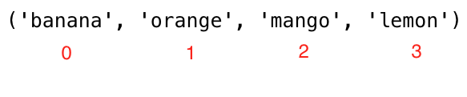
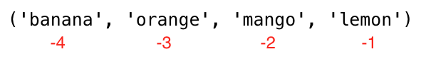

<div align="center">
  <h1>30 Ngày Học Python: Ngày 6 - Tuple</h1>
</div>

[<< Ngày 5](../05_Day_Lists/05_lists.md) | [Ngày 7 >>](../07_Day_Sets/07_sets.md)


- [Ngày 6](#ngày-6)
  - [Tuple](#tuple)
    - [Tạo Tuple](#tạo-tuple)
    - [Độ Dài Tuple](#độ-dài-tuple)
    - [Truy Cập Phần Tử Tuple](#truy-cập-phần-tử-tuple)
    - [Cắt Tuple (Slicing)](#cắt-tuple-slicing)
    - [Chuyển Tuple Thành List](#chuyển-tuple-thành-list)
    - [Kiểm Tra Phần Tử Trong Tuple](#kiểm-tra-phần-tử-trong-tuple)
    - [Nối Tuple](#nối-tuple)
    - [Xóa Tuple](#xóa-tuple)
  - [💻 Bài Tập: Ngày 6](#-bài-tập-ngày-6)

# Ngày 6

## Tuple

Tuple là tập hợp các kiểu dữ liệu khác nhau, có thứ tự và **không thể thay đổi (immutable)**. Tuple được viết trong dấu ngoặc tròn `()`. Một khi tuple được tạo ra, chúng ta không thể thay đổi giá trị của nó. Chúng ta không thể dùng các phương thức add, insert, remove trên tuple vì nó không thể chỉnh sửa. Khác với list, tuple chỉ có một số ít phương thức:

- `tuple()`: tạo tuple rỗng
- `count()`: đếm số lần xuất hiện của một phần tử
- `index()`: tìm chỉ số của một phần tử
- Toán tử `+`: nối hai hay nhiều tuple thành tuple mới

### Tạo Tuple

- Tuple rỗng:

```py
# cú pháp
tuple_rong = ()
# hoặc dùng hàm khởi tạo
tuple_rong = tuple()
```

- Tuple có giá trị ban đầu:

```py
# cú pháp
tpl = ('pt1', 'pt2', 'pt3')
```

```py
trai_cay = ('chuối', 'cam', 'xoài', 'chanh')
```

### Độ Dài Tuple

Dùng hàm `len()` để lấy độ dài của tuple:

```py
# cú pháp
tpl = ('pt1', 'pt2', 'pt3')
len(tpl)   # 3
```

```py
trai_cay = ('chuối', 'cam', 'xoài', 'chanh')
print(len(trai_cay))   # 4
```

### Truy Cập Phần Tử Tuple

- **Chỉ số dương**: Tương tự list, dùng chỉ số dương hoặc âm để truy cập phần tử.



```py
# Cú pháp
tpl = ('pt1', 'pt2', 'pt3')
pt_dau = tpl[0]
pt_hai = tpl[1]
```

```py
trai_cay = ('chuối', 'cam', 'xoài', 'chanh')
qua_dau  = trai_cay[0]           # chuối
qua_hai  = trai_cay[1]           # cam
chi_so_cuoi = len(trai_cay) - 1
qua_cuoi = trai_cay[chi_so_cuoi] # chanh
```

- **Chỉ số âm**: -1 là phần tử cuối, -2 là phần tử áp cuối.



```py
# Cú pháp
tpl = ('pt1', 'pt2', 'pt3', 'pt4')
pt_dau  = tpl[-4]
pt_hai  = tpl[-3]
```

```py
trai_cay = ('chuối', 'cam', 'xoài', 'chanh')
qua_dau     = trai_cay[-4]   # chuối
qua_hai     = trai_cay[-3]   # cam
qua_cuoi    = trai_cay[-1]   # chanh
```

### Cắt Tuple (Slicing)

Chúng ta có thể cắt một phần của tuple bằng cách chỉ định phạm vi chỉ số — kết quả trả về là tuple mới.

- **Chỉ số dương:**

```py
# Cú pháp
tpl = ('pt1', 'pt2', 'pt3', 'pt4')
tat_ca       = tpl[0:4]    # tất cả phần tử
tat_ca       = tpl[0:]     # tất cả phần tử
hai_pt_giua  = tpl[1:3]    # không bao gồm chỉ số 3
```

```py
trai_cay = ('chuối', 'cam', 'xoài', 'chanh')
tat_ca        = trai_cay[0:4]   # tất cả
cam_xoai      = trai_cay[1:3]   # ('cam', 'xoài')
tu_cam_cuoi   = trai_cay[1:]    # ('cam', 'xoài', 'chanh')
```

- **Chỉ số âm:**

```py
# Cú pháp
tpl = ('pt1', 'pt2', 'pt3', 'pt4')
tat_ca      = tpl[-4:]       # tất cả phần tử
hai_pt_giua = tpl[-3:-1]     # không bao gồm chỉ số -1
```

```py
trai_cay = ('chuối', 'cam', 'xoài', 'chanh')
tat_ca       = trai_cay[-4:]      # tất cả
cam_xoai     = trai_cay[-3:-1]    # ('cam', 'xoài')
tu_cam_cuoi  = trai_cay[-3:]      # ('cam', 'xoài', 'chanh')
```

### Chuyển Tuple Thành List

Chúng ta có thể chuyển tuple thành list và list thành tuple. Tuple là bất biến — nếu muốn chỉnh sửa, hãy chuyển nó thành list trước.

```py
# Cú pháp
tpl = ('pt1', 'pt2', 'pt3', 'pt4')
ds  = list(tpl)
```

```py
trai_cay = ('chuối', 'cam', 'xoài', 'chanh')
trai_cay = list(trai_cay)   # chuyển thành list
trai_cay[0] = 'táo'         # bây giờ có thể sửa
print(trai_cay)              # ['táo', 'cam', 'xoài', 'chanh']
trai_cay = tuple(trai_cay)   # chuyển lại thành tuple
print(trai_cay)              # ('táo', 'cam', 'xoài', 'chanh')
```

### Kiểm Tra Phần Tử Trong Tuple

Dùng toán tử `in` để kiểm tra phần tử có tồn tại trong tuple không — trả về boolean.

```py
# Cú pháp
tpl = ('pt1', 'pt2', 'pt3', 'pt4')
'pt2' in tpl   # True
```

```py
trai_cay = ('chuối', 'cam', 'xoài', 'chanh')
print('cam' in trai_cay)    # True
print('táo' in trai_cay)    # False
trai_cay[0] = 'táo'         # TypeError: 'tuple' không hỗ trợ gán phần tử
```

### Nối Tuple

Dùng toán tử `+` để nối hai hay nhiều tuple:

```py
# Cú pháp
tpl1 = ('pt1', 'pt2', 'pt3')
tpl2 = ('pt4', 'pt5', 'pt6')
tpl3 = tpl1 + tpl2
```

```py
trai_cay = ('chuối', 'cam', 'xoài', 'chanh')
rau_cu   = ('cà chua', 'khoai tây', 'bắp cải', 'hành', 'cà rốt')
trai_cay_va_rau = trai_cay + rau_cu
print(trai_cay_va_rau)
```

### Xóa Tuple

Không thể xóa một phần tử đơn lẻ trong tuple, nhưng có thể xóa toàn bộ tuple bằng `del`:

```py
# Cú pháp
tpl1 = ('pt1', 'pt2', 'pt3')
del tpl1
```

```py
trai_cay = ('chuối', 'cam', 'xoài', 'chanh')
del trai_cay
```

🌕 Bạn thật dũng cảm khi đã đi được đến đây. Bạn vừa hoàn thành thử thách ngày 6 và đang tiến thêm 6 bước trên con đường đến sự vĩ đại. Bây giờ hãy làm một số bài tập cho não và cơ bắp của bạn.

## 💻 Bài Tập: Ngày 6

### Bài Tập: Mức 1

1. Tạo một tuple rỗng
2. Tạo một tuple chứa tên anh chị em gái và anh trai của bạn (có thể tưởng tượng)
3. Nối tuple anh em trai và chị em gái, gán vào biến `anh_chi_em`
4. Bạn có bao nhiêu anh chị em?
5. Chỉnh sửa tuple `anh_chi_em` để thêm tên bố và mẹ, gán vào `thanh_vien_gia_dinh`

### Bài Tập: Mức 2

1. Giải nén `anh_chi_em` và `bo_me` từ `thanh_vien_gia_dinh`
2. Tạo tuple trái cây, rau củ và sản phẩm động vật. Nối ba tuple lại và gán vào `thuc_pham_tp`
3. Chuyển `thuc_pham_tp` thành list `thuc_pham_ds`
4. Cắt lấy phần tử hoặc các phần tử ở giữa của `thuc_pham_tp` hoặc `thuc_pham_ds`
5. Cắt lấy 3 phần tử đầu và 3 phần tử cuối từ `thuc_pham_ds`
6. Xóa hoàn toàn tuple `thuc_pham_tp`
7. Kiểm tra phần tử có tồn tại trong tuple:

- Kiểm tra 'Estonia' có phải quốc gia Bắc Âu không
- Kiểm tra 'Iceland' có phải quốc gia Bắc Âu không

  ```py
  quoc_gia_bac_au = ('Denmark', 'Finland', 'Iceland', 'Norway', 'Sweden')
  ```

🎉 CHÚC MỪNG! 🎉

[<< Ngày 5](../05_Day_Lists/05_lists.md) | [Ngày 7 >>](../07_Day_Sets/07_sets.md)
